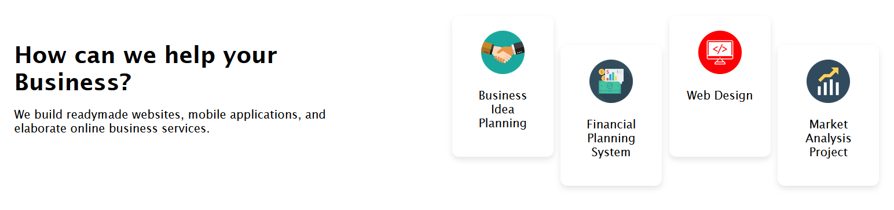

# Laboratory Work Landing Page

This repository contains the landing page for my laboratory works. It serves as a hub for the various projects and experiments I've conducted as a part of my coursework.

## Overview

The landing page is designed to provide a snapshot of the different projects that I have worked on. It includes details about the technologies used and the concepts applied, showcasing my skills and learning progress.

## Page Sections

- **Introduction**: A brief overview of the page and its purpose.
- **Navbar**: Easy navigation to various sections of the page.
- **Main Content**: Details about the latest laboratory work or featured project.
- **Clients**: A metaphorical section that represents partnerships or collaborative work with peers.
- **Help Section**: Information on how to get in touch or seek assistance.
- **Newsletter Section**: A section allowing visitors to subscribe to updates regarding new laboratory works or projects.
- **Informative Section**: Additional resources or links to coursework and related materials.

## Screenshots

Here are some visuals to give you a glimpse into the landing page design:

### Navbar and Introduction


### Main Content


### Collaborative Work


### Assistance Section


### Updates Subscription


### Additional Resources


## Live Page

You can view the live version of the landing page here: [Laboratory Work Landing Page](https://stefannistor69.github.io/PW_lab2/).

## Local Setup

If you want to run the page locally on your machine, follow these steps:

```bash
git clone https://github.com/stefannistor69/PW_lab2.git
cd PW_lab2
# Open index.html in your preferred browser
